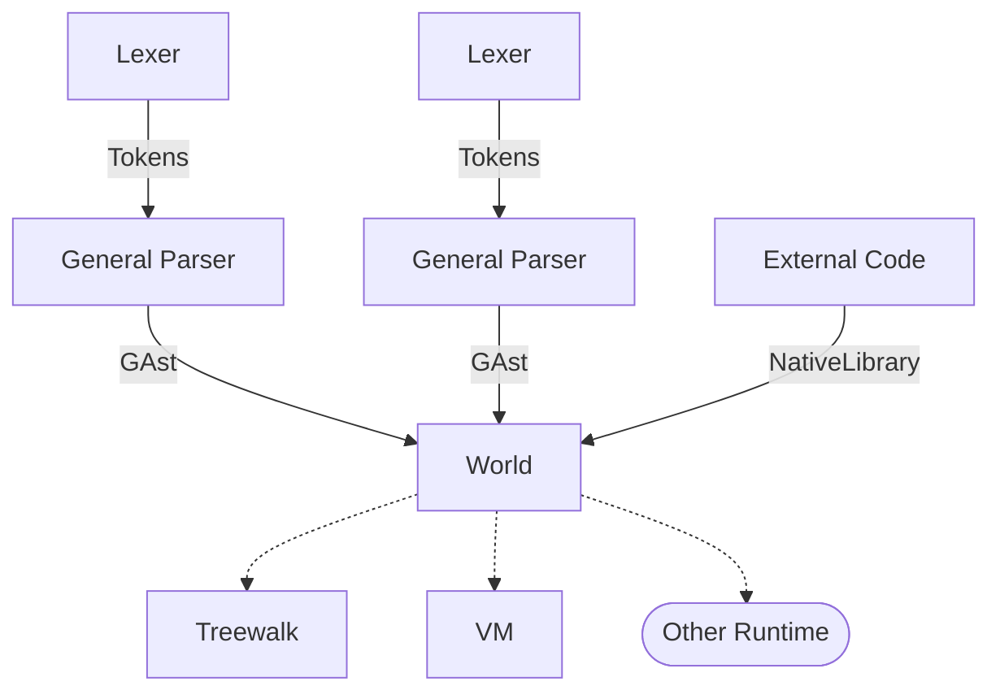

# Magus - an R7RS impl for Magicflute

## Architecture



### Frontend

There are 2 parts of the frontend:
- Lexer
- General Parser

The formal syntax of R7RS is encoded in the lexer and general parser, where the lexer handles things that can be
recognized by regular expressions (identifiers, numbers, strings, etc.) while the general parser handles things
that can't be (nested comments, datum, datum comments, bytevectors, vectors) (anything that requires pairing).

This forms the GAST which is just a representation of what a given file *literally* contains. (these should map to a backing CST from `rowan`).

No macro interpretation is done at this point (and special forms are handled by this layer).

A World defines *all* modules that can possibly exist. A script is only allowed to import libraries defined by modules from its World.
(In fact, any value is able to be shared between runtimes if they share the same World. This is to
make implementing Scheme macros easier \[I hope...])

### Runtime

The runtime is responsible for reading and executing on a World's GAst.

Treewalk is a treewalk interpreter, which is the slowest execution method, but it's goal is to be auditable, and used as a reference implementation.
VM is a virtual machine whose goal is to speed up execution, while maintaining 100% accuracy with Treewalk.

## Numbers

Numbers are of particular interest to Schemers, and I'm happy to say that we support *lexing*
all forms of numbers (and with how we store them, the Scheme `ieee-float` feature). However,
we currently do not have a runtime that supports numbers beyond exact integers (for my purposes,
this is fine).

### IMPL NOTES

## Hygenic macros

~~(why is having hyg*i*ene considered *hyge*nic??? anyways)~~
Hygenic macros have the property that "they mean the same thing everywhere".
To put this in more formal terms, this means that the evaluation of a macro *always*
takes place in the same environment, namely the one it was defined in.
If I were to define in `hygiene.scm`:

```scheme
(import (scheme base))
(define-syntax x! (syntax-rules () 
    ((x! val)
        (set! x val))
))
(define-syntax define-x (syntax-rules ()
    ((define-x val)
        (begin 
            (define x val)
            (x! (+ val 1))
            x
        ))
))

;; this should error!
(define-x 6)
;; but if *above* that line, you defined `x`, it would work and the
;; value would be overwritten by (the number you passed in + 1)
```
