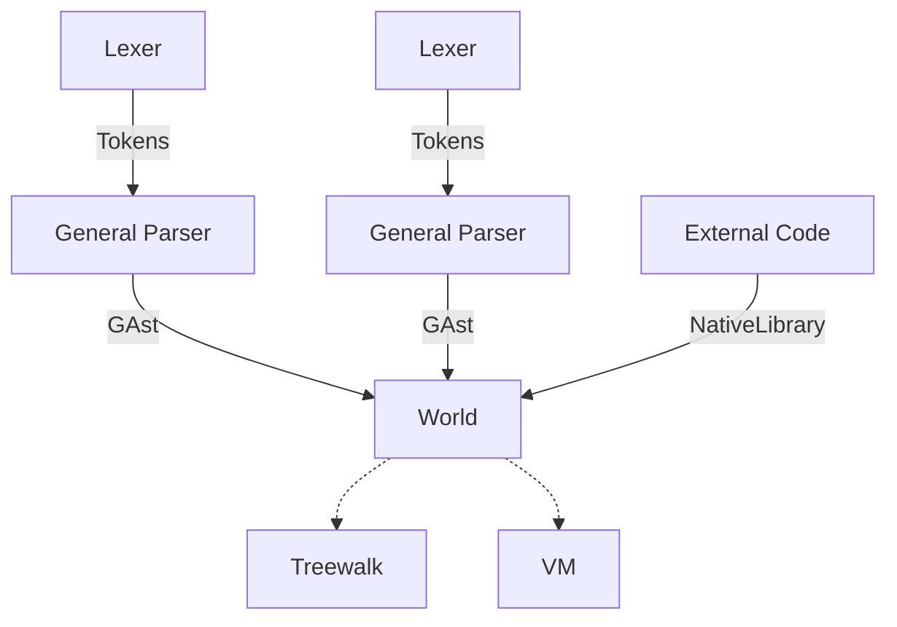

# Magus - an R7RS impl for Magicflute

## Architecture

### Frontend

There are 2 parts of the frontend:
- Lexer
- General Parser

The formal syntax of R7RS is encoded in the lexer and general parser, where the lexer handles things that can be
recognized by regular expressions (identifiers, numbers, strings, etc.) while the general parser handles things
that can't be (nested comments, datum, datum comments, bytevectors, vectors) (anything that requires pairing).

This forms the GAST which is just s-expressions, (byte)vectors, and nested items. (these should map to a backing CST from `rowan`).

A World defines *all* modules that can possibly exist. A script is only allowed to import libraries defined by modules from its World.

### Backend

The backend is responsible for reading and executing on a World's GAst.

Treewalk is a treewalk interpreter, which is the slowest execution method, but it's goal is to be auditable, and used as a reference implementation.
VM is a virtual machine whose goal is to speed up execution, while maintaining 100% accuracy with Treewalk.

## Numbers and exactness

Scheme has an exact/inexact concept where inexactness in infectious.
We add something on top of that which is in the case that there is a user definition that
is converted to inexact, the syntax is not allowed to explicitly mark itself as exact, so that
#e3.5 is *exactly* 3.5 (or $\frac{35}{10}$), not the floating-point 3.5 for any reason, but 3.5 allows
the most expedient implementation.
