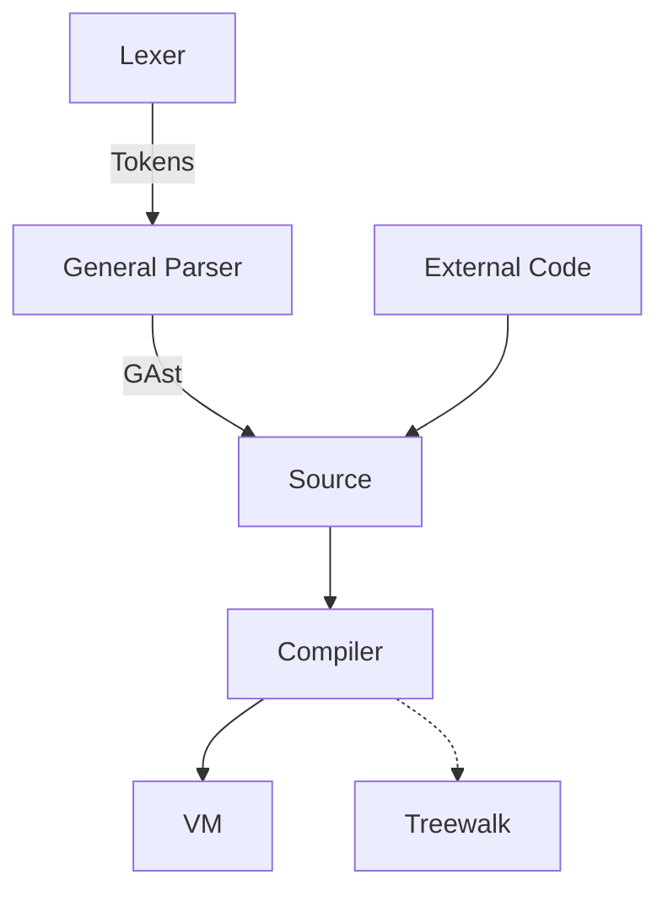

# Introduction

```mermaid
graph TD
    lex[Lexer] -->|Tokens| gparse[General Parser]
    gparse -->|GAst| wd
    ext[External Code] --> wd
    wd[Source] --> Compiler
    Compiler --> VM
    Compiler -.-> Treewalk
```

This is the overall framework for how magus conpiles and interprets R5RS scheme code in
order to declare Magic: the Gathering abilities.
